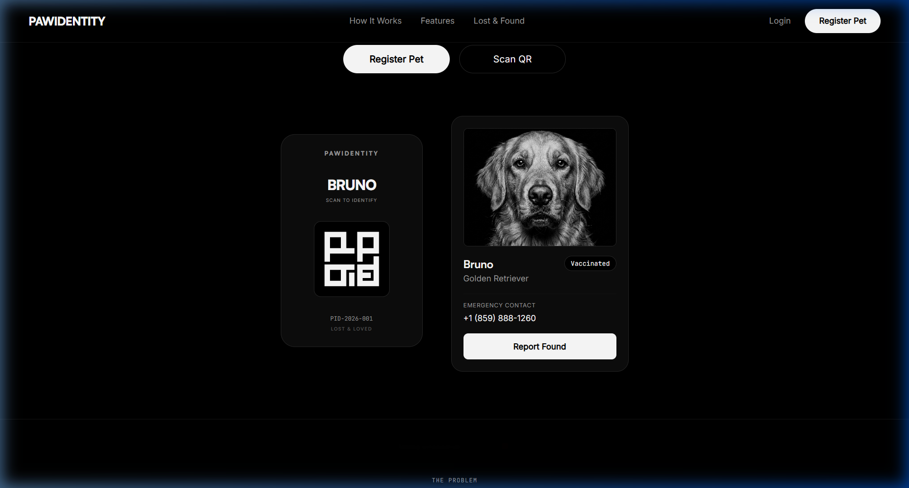
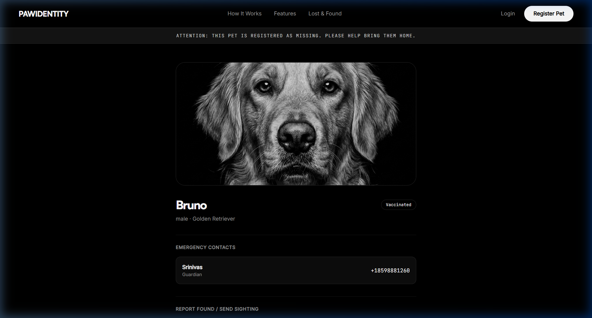
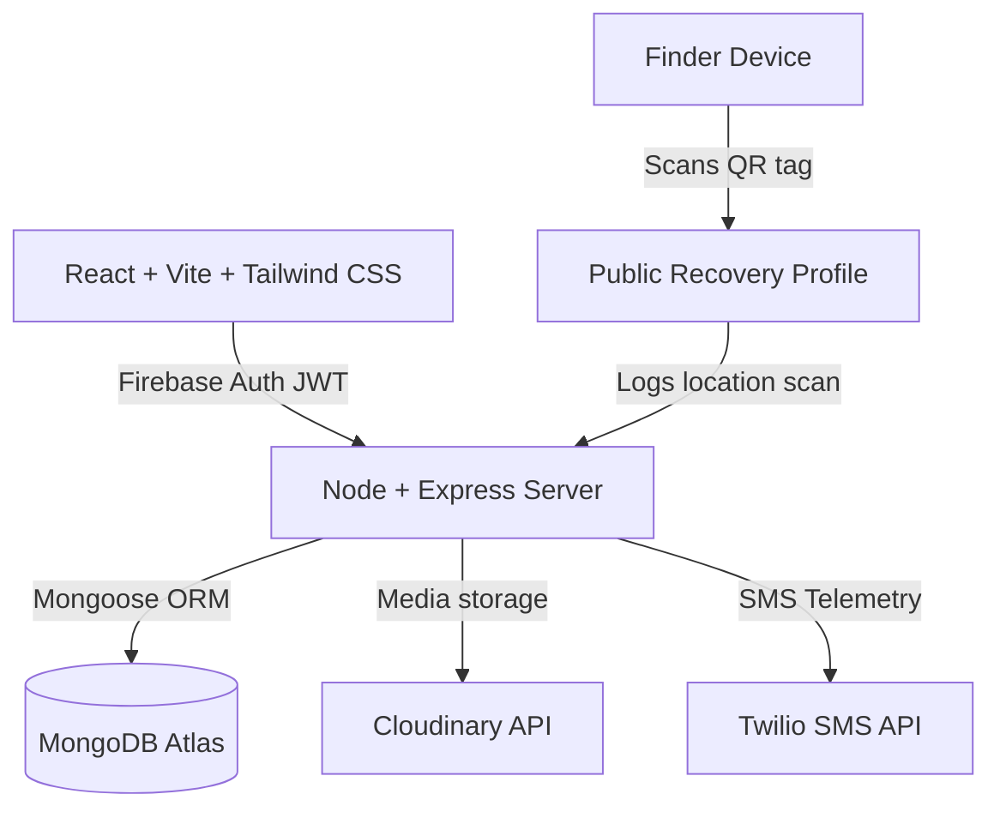

# PawIdentity — One Scan Away From Home

PawIdentity is a premium, minimal digital pet identity and recovery platform. Inspired by the design philosophies of MUJI, Apple Wallet, and Linear, PawIdentity provides a zero-friction, monochromatic interface for pet management and lost recovery telemetry.

---

## 📸 Verification Screenshots

### 1. Hero Layout (Cards Side-by-Side)
Features a centered title, call-to-action buttons, a floating QR Smart Tag, and Bruno's Pet Preview card.



### 2. Sighting Sourced Recovery Profile (`/pet/bruno`)
Automatically logs visitor telemetry (coordinates, device type, browser) in the background on scanning and triggers owner notification alerts.



---

## 🚨 Problem Statement

Standard physical pet collars only contain a static phone number that can fade, get worn out, or go unanswered when a pet goes missing. Additionally, traditional tags do not notify the owner when they are found or scanned.

**PawIdentity** solves this by providing:
- **QR Smart Tags**: Each pet collar is fitted with a unique QR tag containing a slug-based profile link.
- **Instant Scan Telemetry**: Scanning the QR code prompts the visitor for browser geolocation, captures their device agent, logs the event to a database, and alerts the owner instantly via Twilio SMS.
- **Secure Profiles**: Displays crucial information (photo, name, emergency contacts, vaccination status) while hiding owner email, address, and medical records from the public.

---

## 🛠️ Architecture & Tech Stack



### Stack Components
- **Client (Frontend)**: React, Vite, Tailwind CSS v4, Framer Motion, React Router DOM, Axios, Firebase Client SDK.
- **Server (Backend)**: Node.js, Express.js (ES Modules configuration), Mongoose, Firebase Admin SDK, Cloudinary, Twilio, qrcode.
- **Database**: MongoDB Atlas.
- **State Management**: React Context API (No Redux).

---

## 🗄️ Database Models

1. **User**: Stores firebaseUID, name, email, phone, role (`owner`, `vet`, `shelter`, `admin`), and verification status.
2. **Pet**: Stores owner reference, name, species, breed, gender, date of birth, photo, vaccination status, and emergency contacts list.
3. **QRTag**: Logs pet reference, unique tagId, slug, generated QR image URL, scan count, and last scanned date.
4. **MedicalRecord**: Stores pet reference, title, record type, text description, attachments, and the vet reference.
5. **Vaccination**: Records pet reference, vaccine name, date given, next due date, batch number, and verification status.
6. **LostPet**: Manages active missing listings, reward details, last seen description, and finder report fields.
7. **ScanLog**: Captures latitude, longitude, city, country, device, browser, and scan timestamp.
8. **Notification**: Links unread scan reports, vaccine renewals, and lost/found feeds to owner dashboards.

---

## 🚀 Getting Started

### Prerequisites
- Node.js (v18+)
- MongoDB Atlas cluster
- Firebase project, Cloudinary, and Twilio developer keys

### 1. Setup Backend Server
1. Navigate to `/server`.
2. Create a `.env` file containing:
   ```env
   PORT=3000
   MONGODB_URI=your_mongodb_atlas_uri
   CLOUDINARY_CLOUD_NAME=your_cloud_name
   CLOUDINARY_API_KEY=your_api_key
   CLOUDINARY_API_SECRET=your_api_secret
   TWILIO_ACCOUNT_SID=your_twilio_sid
   TWILIO_AUTH_TOKEN=your_twilio_token
   TWILIO_PHONE_NUMBER=your_twilio_phone
   ```
3. Install dependencies and seed mock data:
   ```bash
   npm install
   node utils/seed.js
   ```
4. Start the server:
   ```bash
   npm start
   ```

### 2. Setup Client Frontend
1. Navigate to `/client`.
2. Create a `.env` file containing:
   ```env
   VITE_FIREBASE_API_KEY=your_api_key
   VITE_FIREBASE_AUTH_DOMAIN=your_auth_domain
   VITE_FIREBASE_PROJECT_ID=your_project_id
   VITE_FIREBASE_STORAGE_BUCKET=your_storage_bucket
   VITE_FIREBASE_MESSAGING_SENDER_ID=your_sender_id
   VITE_FIREBASE_APP_ID=your_app_id
   VITE_SERVER_URL=http://localhost:3000
   ```
3. Install dependencies:
   ```bash
   npm install
   ```
4. Start the development server:
   ```bash
   npm run dev
   ```
